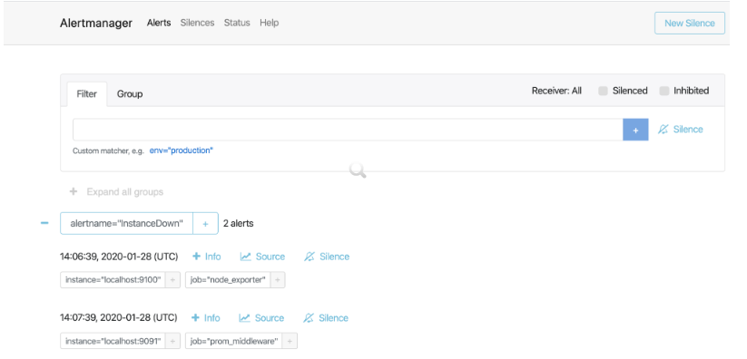

# 监控

###### Jennings Liu
<!-- _class: cover_b fixedtitleA
<!-- _header: "" -->
<!-- _footer: "" -->
<!-- _paginate: "" -->
##
<!-- _header: 目录 CONTENTS  -->
<!-- _class: toc_b -->

- [监控设计](#3)
- [监控内容](#4)
- [监控报告](#6)

## 监控设计
<!-- _header: \ ***云运维*** **监控设计** *监控内容* *监控报告* -->
<!-- _class:  navbar bq-green fixedtitleA  -->

  

## 监控设计
<!-- _header: \ ***云运维*** **监控设计** *监控内容* *监控报告* -->
<!-- _class: cols-2  navbar bq-green fixedtitleA  -->

## 监控设计
<!-- _header: \ ***云运维*** **监控设计** *监控内容* *监控报告* -->
<!-- _class: navbar bq-green fixedtitleA  -->

## 监控设计
<!-- _header: \ ***云运维*** **监控设计** *监控内容* *监控报告* -->
<!-- _class:  navbar bq-green fixedtitleA  -->

## 监控内容
<!-- _header: \ ***云运维*** *监控设计* **监控内容** *监控报告*-->
<!-- _class:  navbar bq-green fixedtitleA  -->
> 主机硬件监控：

- 硬件启用状态
- 硬件健康状态
- 温度

> 操作系统：

- CPU
- 内存
- 硬盘/IO
- 网络
- 进程
- ....

## 监控内容
<!-- _header: \ ***云运维*** *监控设计* **监控内容** *监控报告* -->
<!-- _class:  navbar bq-green fixedtitleA  -->

- 云平台监控：
  - 各个组件状态
  - 使用状态
  - 云上虚拟机
  - Ceph存储系统

> 系统服务监控：

- RocketMQ队列
- Pacemaker集群
- MySQL数据库
- ...

## 监控报告
<!-- _header: \ ***云运维*** *监控设计* *监控内容* **监控报告**-->
<!-- _class:  navbar bq-green fixedtitleA  -->

> 图形展示

- grafana 仪表板

> 监控报告

- 可以采用PPT模版，使用自动化的脚本生成报告
  - [Grafana API – Export Graph as png image](https://mattionline.de/grafana-api-export-graph-as-png/)
  - [利用python-pptx库读写操作PPT,批量自动生成或修改的PPT](https://www.dszhp.com/python-pptx.html)
- [使用Marp创建PPT报告](https://marpit.marp.app/)
